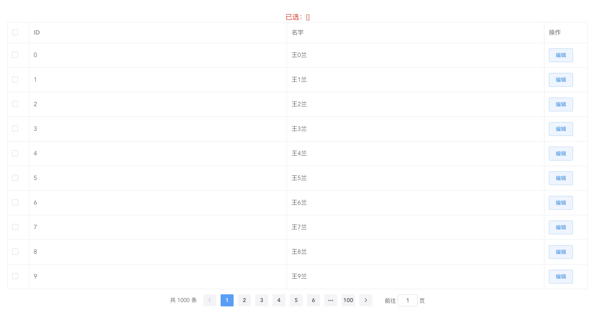
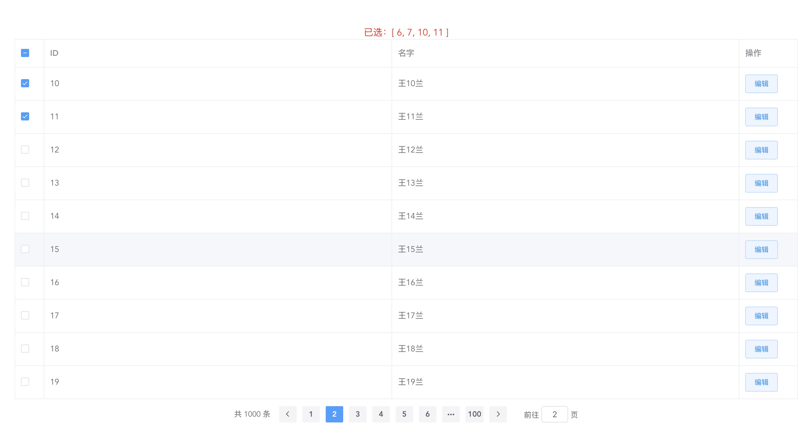

## 实现分页复选

### 背景

后台管理系统中，使用表格展示数据时，可能的需求是多项选择然后进行批量操作，也期望能翻页多选。

### 实现

页面结构如下
```html
<el-table
  class="table"
  :data="tableData"
  border
  style="width: 100%"
  @selection-change="handleSelectionChange"
  ref="asTable"
>
  <el-table-column
    width="50"
    type="selection"
    fixed="left"
  >
  </el-table-column>
  <el-table-column
    prop="id"
    label="ID"
  >
  </el-table-column>
  <el-table-column
    prop="name"
    label="名字"
  >
  </el-table-column>

  <el-table-column
    label="操作"
    width="100"
  >
    <template slot-scope="scope">
      <el-button type="primary" plain size="small" @click="handleEdit(scope.row)" >编辑</el-button>
    </template>
  </el-table-column>
</el-table>
<el-pagination
  background
  @current-change="handleCurrentChange"
  :current-page.sync="pagination.currentPage"
  :page-size="pagination.size"
  layout="total, prev, pager, next, jumper"
  :total="pagination.total"
  slot="pagination"
>
</el-pagination>
```
模拟数据实现分页
```js
data () {
  return {
    tableData: [],
    multipleSelection: [],
    pagination: {
      currentPage: 1,
      size: 10,
      total: 1000
    }
  }
},
beforeMount () {
  this.fetchData()
},
methods: {
  fetchData () {
    this.tableData = []
    let start = (this.pagination.currentPage - 1) * this.pagination.size
    let end = this.pagination.currentPage * this.pagination.size
    setTimeout(_ => {
      for (let i = start; i < end; i++) {
        this.tableData.push({
          id: i,
          name: `王${i}兰`
        })
      }
    }
  },
  handleCurrentChange () {
    this.fetchData()
  },
  handleSelectionChange (val) {
    this.multipleSelection = val
  },
}
```

展示已选择项
```html
<div class="result">
  已选：{{ allMultipleSelection }}
</div>
```

```js
allMultipleSelection: [],
```

在复选事件中对所选项进行存储

主要思路就是：
- 将当前页已选数据放入所有已选项
- 将所有已选项数据中当前页没选择的项移除
```js
handleSelectionChange (val) {
  this.multipleSelection = val
  // @tip 实现分页复选
  console.log(val, 'selection')
  setTimeout(_ => {
    this.resolveAllSelection()
  }, 50)
},
resolveAllSelection () {
  let currentPageData = this.tableData.map(item => item[this.uniqueKey]) // 当前页所有数据
  let currentPageSelected = this.multipleSelection.map(item => item[this.uniqueKey]) // 当前页已选数据
  let currentPageNotSelected = currentPageData.filter(item => !currentPageSelected.includes(item)) // 当前页未选数据
  // 将当前页已选数据放入所有已选项
  currentPageSelected.forEach(item => {
    if (!this.allMultipleSelection.includes(item)) {
      this.allMultipleSelection.push(item)
    }
  })
  // 将所有已选项数据中当前页没选择的项移除
  currentPageNotSelected.forEach(item => {
    let idx = this.allMultipleSelection.indexOf(item)
    if (idx > -1) {
      this.allMultipleSelection.splice(idx, 1)
    }
  })
  console.log(this.allMultipleSelection, 'all')
},
```

此时还需要在切换页面时将之间选择项进行重新选中，即遍历当前页所有数据如果存在于所有已选项中，则将其置为已选择。
```js
fetchData () {
  // ...
  setTimeout(_ => {
    // ...
    // @tip 实现分页复选
    setTimeout(_ => {
      this.setSelectedRow()
    }, 50)
  }, 200)
},
setSelectedRow () {
  // 设置当前页已选项
  this.tableData.forEach(item => {
    if (this.allMultipleSelection.includes(item[this.uniqueKey])) {
      this.$refs.asTable.toggleRowSelection(item, true)
      console.log(item[this.uniqueKey], 'set')
    }
  })
},
```

以上实现了分页复选功能。

所有代码存放在[@careteen/lan-vue](https://github.com/careteenL/lan-vue/blob/master/examples/Table/PagingCheck.vue)

### 查看DEMO
clone仓库并引入依赖
```shell
git clone git@github.com:careteenL/lan-vue.git
npm install
npm run serve
```
浏览器打开 [http://localhost:8080/#/examples/pagingCheck](http://localhost:8080/#/examples/pagingCheck) 即可看到效果
